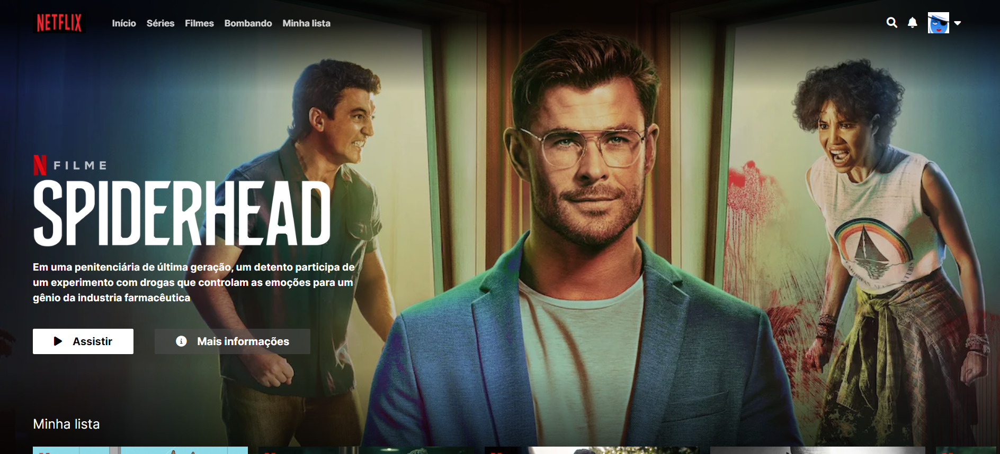
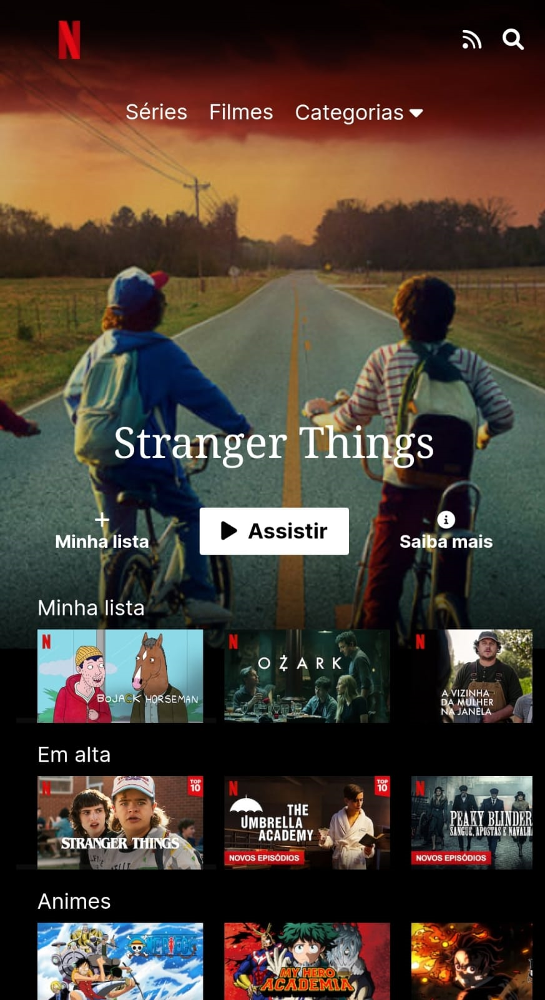

## Clone da Netflix
Este projeto foi desenvolvido para praticar meus conhecimentos em HTML e CSS, construido na 7 days of code da Alura. Ele inclui responsividade para mobile.

## Tecnologias utilizadas
- HTML
- CSS
